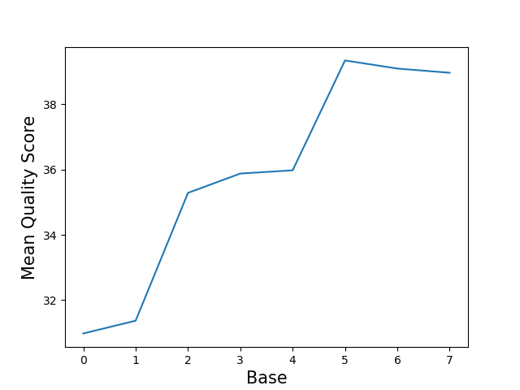
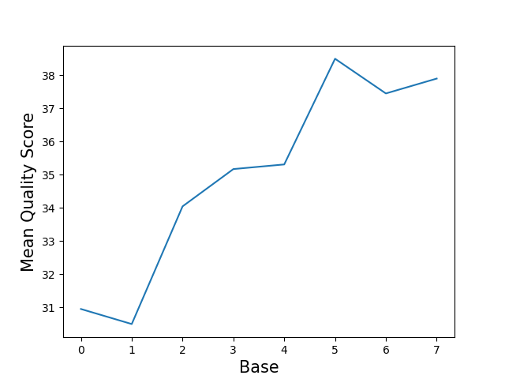
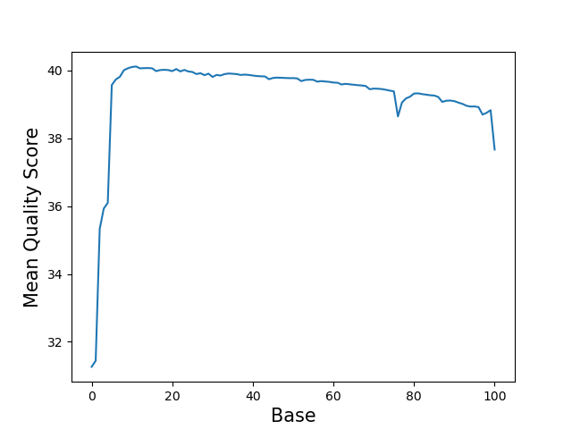
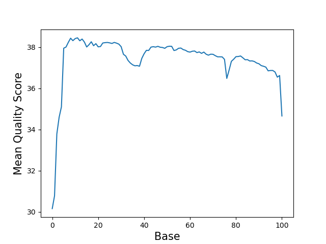

# Assignment the First

## Part 1
1. Be sure to upload your Python script.

| File name | label |
|---|---|
| 1294_S1_L008_R1_001.fastq.gz | read1 |
| 1294_S1_L008_R2_001.fastq.gz | index1  |
| 1294_S1_L008_R3_001.fastq.gz | index2  |
| 1294_S1_L008_R4_001.fastq.gz | read2 |

2. Per-base NT distribution
    1. Use markdown to insert your 4 histograms here.   
    Index 1:
       
    Index 2:
       
    Read 1:
       
    Read 2:
    

    2. Quality score cutoff for biological reads should be Q20 (99% base call accuracy) sufficient for aligning the mRNA to the refrence genome while ccounting for the PCR/Reverse transcriptase errors.
    3. Quality score cutoff for index reads should be Q20 (99% base call accuracy) which woud allow for error correction of a single base in order to correctly bin the samples.

3. N content of indexes
```
>zcat /projects/bgmp/shared/2017_sequencing/1294_S1_L008_R2_001.fastq.gz | sed -n '2~4p' | grep -c "N"
3976613
>zcat /projects/bgmp/shared/2017_sequencing/1294_S1_L008_R3_001.fastq.gz | sed -n '2~4p' | grep -c "N"
3328051
```

    
## Part 2
1. Define the problem
```
There are reads in the fastq files that have incorrect indexes due to index hopping. 
```
2. Describe output
```
We have to seperate out reads into 24 sample files, 1 file for hopped indexes and 1 for reads with no identifiable index.
```
3. Upload your [4 input FASTQ files](../TEST-input_FASTQ) and your [>=6 expected output FASTQ files](../TEST-output_FASTQ).
4. Pseudocode
```
Open 2 read files and 2 index files.
Open 2 files for each index
Open 2 files for hopped indexes
Open 2 files for garbage indexes

Initialize dictionary for storing seqeunce lines and barcodes for each record
    -indexed by header
    -values are np.array of length 2

while(True):
    read first four lines from the index 1 file -> list_i1
    if (list_i1[0]==""):
        break
    read first four lines from the index 2 file -> list_i2
    read first four lines from the read 1 file -> list_r1
    read first four lines from the read 2 file -> list_r2


    -strip newlines
    -store sequence in 1st position
    of np.array (dictionary value)

    for (records of index files):
        -filter out indexes with low qscores and Ns

        if (i1 == rev comp of i2):
            add "i1-i2" to the 2nd position of the np.array
            write header+"i1_i2" and seq to "i1_i2.fq"
        else:
            if (i2 rev comp in Indexes | i1 in Indexes):
                add "hopped" instead
                write header+"hopped" and seq to "hopped.fq"
            else:
                add "bad_index" 
                write header+"bad_index"+ "bad_index.fq"
        


close all files
```
5. High level functions. For each function, be sure to include:
    1. Description/doc string
    2. Function headers (name and parameters)
    3. Test examples for individual functions
    4. Return statement

    def complement(letter):   
        ''' Takes in a letter and
         returns complimentary bases'''   
         letter=upper(letter)
        bases_dict={
            'A':'T'
            'T':'A'
            'G':'C'
            'C':'G'
            'N':'N'
        }    
        return bases_dict.get(letter)   
Test examples: ("A","n","a","T")


    def revcomp(sequence_line):   
        '''Takes in a sequence line of ATCGNs and returns the reverse complement'''   
        reverse_seq=""   
        for (letter in reverse(sequence_line)):   
            reverse_seq+= complement(letter)   
            return reverse_seq   
            
    Test examples: ("AcTGa","nTCGN")


